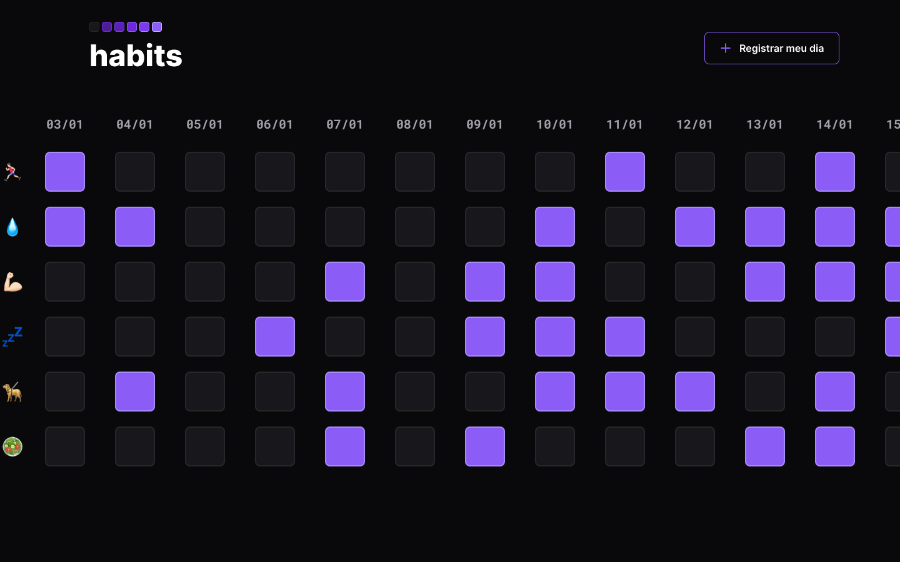

<h1 align="center"> Habits <h1>

NLW é um evento exclusivo, promovido pela Rocketseat para ensino de tecnologias WEB  

    <a href="-tecnologias">Tecnologias</a>&nbsp;&nbsp;&nbsp;|&nbsp;&nbsp;&nbsp;
    <a href="-projetos">Projetos</a>&nbsp;&nbsp;&nbsp;|&nbsp;&nbsp;&nbsp;
    <a href="-layouts">Layouts</a>&nbsp;&nbsp;&nbsp;|&nbsp;&nbsp;&nbsp;
    <a href="-licenças"> Licenças</a>

    

 

## Tecnologias
Esse projeto foi desenvolvido com as seguintes tecnologias: 
- HTML e CSS
- JavaScript
- Git e Gihub
- Figma

## Projetos 
O Habits é um app para ajudar a rastreas os hábitos.
- [Visite o projeto online](https://mateusvmoura.github.io/Habits/)